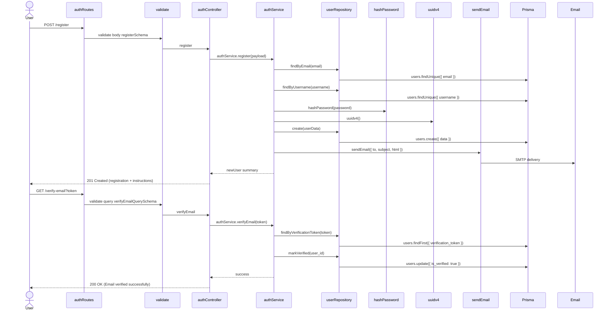
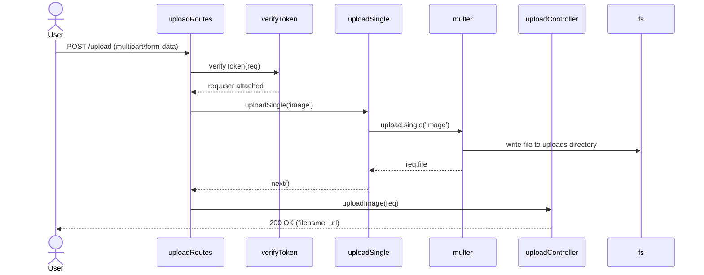

## Reviewer's Guide

This pull request replaces the legacy mysql2-based course data layer with Prisma, and adds a full authentication and file upload stack (JWT auth, email verification, guarded upload endpoints), while updating documentation, error handling, logging, and routing to reflect the new architecture and features.

#### Sequence diagram for the new authentication register and email verification process

#### Sequence diagram for the protected file upload process

### File-Level Changes

| Change | Details | Files |
| ------ | ------- | ----- |
| Migrate course data access from raw MySQL queries to Prisma with enhanced filtering, sorting, pagination, and nested relations. | <ul><li>Replace custom pool-based repository helpers with a Prisma-backed courseRepository object.</li><li>Implement getAll using v_course_cards via $queryRawUnsafe, supporting filters (status, level, category_id, topic, search) and sortBy options.</li><li>Implement getById using Prisma includes for tutors, categories, modules/materials, and reviews.</li><li>Refactor create, update, softDelete, and hardDelete to use Prisma CRUD APIs instead of SQL statements.</li></ul> | `src/repositories/courseRepository.js` |
| Refactor course service layer to use the new repository API, simplify validation, and adjust delete semantics. | <ul><li>Replace custom AppError factory and normalization helpers with a simpler AppError class and logger usage.</li><li>Update getCourses to consume the new getAll result (data + total) and rebuild pagination meta manually.</li><li>Simplify getCourseById, createCourse, updateCourse, and deleteCourse to use Prisma-based repository methods and return new soft/hard delete payload format.</li><li>Remove legacy pagination/slug/normalization logic that was specific to raw SQL schema assumptions.</li></ul> | `src/services/courseService.js` |
| Centralize course validation in a dedicated Zod validation module and streamline course routes to use it. | <ul><li>Move inline Zod schemas for params, query, and body into src/validations/courseValidation.js.</li><li>Add support in query validation for new filters (topic, search) and sortBy options.</li><li>Adjust route handlers to use the new validation schemas and updated semantics (PUT uses create schema, DELETE no longer validates hard flag in query).</li></ul> | `src/routes/courseRoutes.js` `src/validations/courseValidation.js` |
| Extend global error handling to understand Prisma errors while keeping MySQL error mapping and standardizing messages. | <ul><li>Add PrismaClientKnownRequestError handling for codes P2002, P2003, P2025, P2001, P2011, P2000, P2007, P2014, P2010, mapping them to appropriate HTTP status codes and human-readable messages.</li><li>Refine duplicate-entry parsing and MySQL-specific detail building helpers to be more concise.</li><li>Keep production-safe messaging for 5xx errors and log normalized error payloads before responding.</li></ul> | `src/middlewares/errorHandler.js` |
| Introduce Prisma ORM configuration and client initialization, and update server bootstrap/shutdown to work without the old mysql2 pool. | <ul><li>Add prisma.config.ts and prisma/schema.prisma along with src/config/prisma.js to configure and instantiate PrismaClient.</li><li>Wire Prisma disconnect into SIGINT/SIGTERM listeners inside prisma config, and simplify server.js to only handle HTTP server lifecycle.</li><li>Remove legacy src/config/database.js usage and related graceful shutdown DB pooling logic.</li></ul> | `prisma.config.ts` `prisma/schema.prisma` `src/config/prisma.js` `server.js` `src/config/database.js` |
| Add a complete authentication stack (register, login, email verification, protected profile) using JWT, bcrypt, Nodemailer, and Prisma. | <ul><li>Create authService with register/login/verifyEmail flows backed by userRepository and UUID verification tokens.</li><li>Implement userRepository on top of Prisma users table (findByEmail, findByUsername, create, findByVerificationToken, markVerified).</li><li>Add JWT helpers (generateToken, verifyToken) and password helpers (hashPassword, comparePassword).</li><li>Add authController and authRoutes wiring register/login/verify-email/me endpoints with Zod-based validation schemas.</li><li>Implement SMTP/Ethereal mailer configuration and initialization via src/config/mailer.js.</li></ul> | `src/services/authService.js` `src/repositories/userRepository.js` `src/utils/jwt.js` `src/utils/hash.js` `src/controllers/authController.js` `src/routes/authRoutes.js` `src/validations/authValidation.js` `src/config/mailer.js` |
| Introduce JWT-based authorization middleware and secure, validated file upload functionality with static serving. | <ul><li>Add authMiddleware.verifyToken and requireRole to guard protected routes and attach user context from JWT.</li><li>Implement uploadMiddleware with Multer disk storage, MIME-type and size limits, and normalized error propagation.</li><li>Create uploadController and uploadRoutes to handle authenticated POST /upload image uploads and return file metadata + URL.</li><li>Serve /uploads as a static directory via Express in app.js.</li></ul> | `src/middlewares/authMiddleware.js` `src/middlewares/uploadMiddleware.js` `src/controllers/uploadController.js` `src/routes/uploadRoutes.js` `src/app.js` |
| Standardize JSON response messages and expand routing/index wiring to surface new endpoints and health information. | <ul><li>Update respond.js helpers to use English, generic success/error messages for created/updated/deleted/data responses.</li><li>Update routes index to mount auth and upload routers and to expose endpoint URLs in the root /api/v1 index and health responses.</li><li>Ensure root (/) and /api/v1/health endpoints continue to use sendSuccess and reflect new capabilities.</li></ul> | `src/utils/respond.js` `src/routes/index.js` |
| Introduce centralized logging via Winston (integrated with Morgan) and update configuration/docs to reflect the new stack. | <ul><li>Add src/utils/logger.js with console and file transports and a morganStream for HTTP logging.</li><li>Update app.js to keep Morgan but (optionally) align with the new logger.</li><li>Update README.md and TESTING.md to describe Prisma migration, auth + upload features, new endpoints, and master test plan.</li><li>Add new runtime dependencies (Prisma, bcrypt, jsonwebtoken, nodemailer, multer, uuid, winston) and dev dependency prisma to package.json; update package-lock.json accordingly.</li></ul> | `src/utils/logger.js` `src/app.js` `README.md` `TESTING.md` `package.json` `package-lock.json` |

---
